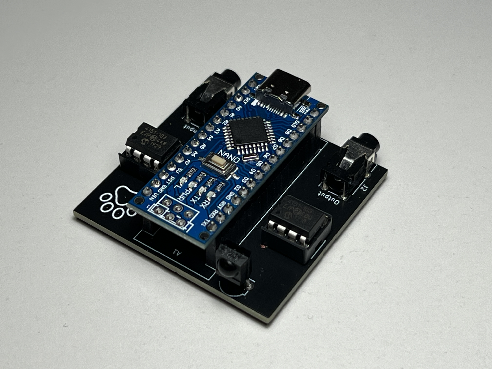
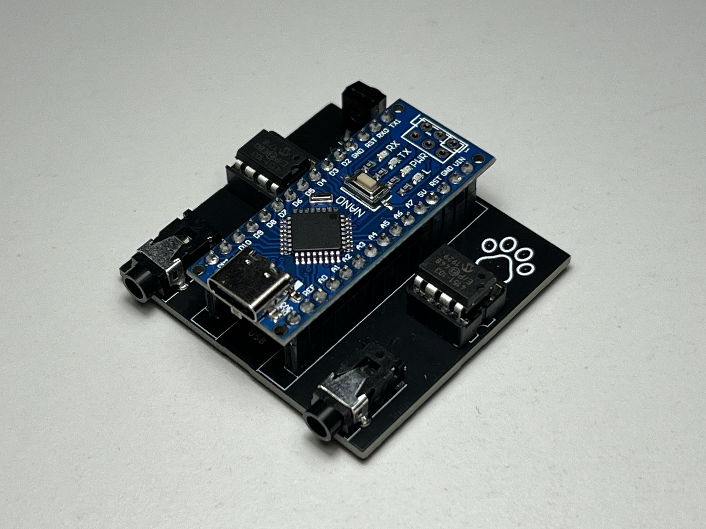
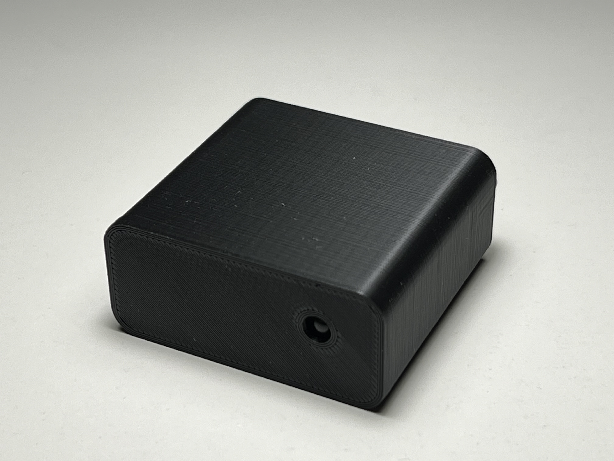
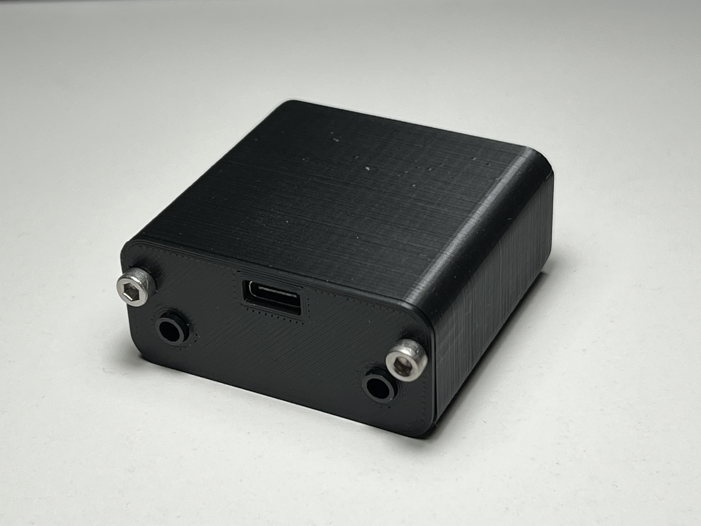

# Infrared volume control
 Digital audio volume controller for use with IR remote  

 ## Origin of project
 My friend pandora has a Philips TV with okay sound but not great. Would be nice to have some additional speakers.  
 Speakers can be connected to a headphone jack but volume can not be easily changed without entering two submenus of the TV.  
 The solution: Our own PCB with an IR receiver and an Arduino who decodes the commands "volume up" and "volume down" from the IR remote sent as RC6 protocol. These commands then are used to change the value of two digital potentiometers, one for each audio channel after the loudspeakers of the TV are diabled in the settings.

 ## Circuit
 TSOP34836 for demodulating the 36kHz IR signal, can be changed for other carrier frequencies.  
 Arduino nano clone with USB-C for all things digital.  
 MCP4151 digital potentiometer for attenuating audio level.  
 Inductors for filtering some noise on the power rails, especially when SPI is active.  
Resistors and capacitors for creating a virtual ground.  

## Housing
Simple 3D printed case, nothing fancy.  
  
  
  
  
  
